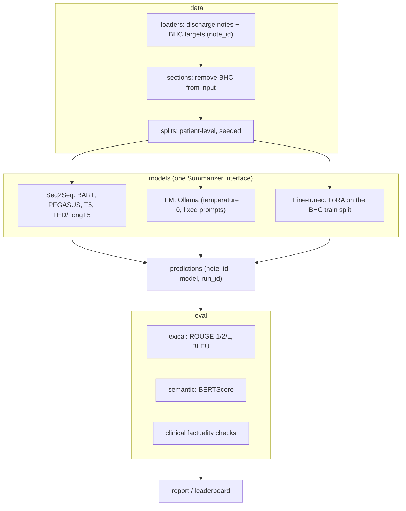

# Clinical Discharge Summarization Benchmark

A reproducible benchmark for generating the **Brief Hospital Course (BHC)** of a hospital discharge note. It compares encoder-decoder summarizers with local open-weight LLMs on de-identified MIMIC-IV notes, using lexical, semantic and clinical-factuality metrics.

> **Status: early development.** This repository contains the project skeleton, the core data and text utilities (with tests), and the roadmap below. Model adapters and evaluation are being built milestone by milestone.

## Why another summarization benchmark?

Quick clinical-summarization experiments are easy to get wrong in ways that quietly inflate scores. This project treats each pitfall as a design requirement:

| Pitfall | How this project handles it |
|---|---|
| **Target leakage.** The full discharge note usually still contains the "Brief Hospital Course" section, which *is* the reference summary. | `data.sections.remove_bhc()` strips that section from every input before any model sees it |
| **Misaligned evaluation.** Predictions and references get compared by row position. | Everything is keyed by `note_id`, and `eval.metrics` refuses unaligned inputs |
| **Patient leakage across splits.** | `data.splits` assigns splits by a stable hash of `subject_id` (patient level), so the split is deterministic |
| **Different models on different samples.** | One shared, seeded test split for every model |
| **Reasoning text scored as summary.** Models like DeepSeek-R1 emit `<think>…</think>`. | `text.strip_reasoning()` removes it before scoring |
| **Corrupting text with naive abbreviation expansion** ("ART" in "ARTERIAL"). | Optional, word-boundary-safe expansion, measured as an ablation |
| **Silent truncation of long notes.** | Long-context models and chunk-then-summarize (map-reduce), with the truncation rate reported |
| **Non-reproducible LLM runs.** | Temperature 0, a fixed seed, versioned prompt templates, and the config saved with every run |
| **ROUGE can't see dangerous errors.** | Medication, dose and diagnosis consistency checks, plus a factual-consistency score and a human-review rubric |

## Architecture



## Project layout

```
src/clinical_summarization/
  text.py            reasoning-tag stripping, whitespace, safe abbreviation expansion
  data/loaders.py    load notes and targets, build note_id-aligned pairs
  data/sections.py   section parsing and BHC removal
  data/splits.py     deterministic patient-level splits
  models/base.py     Summarizer interface
  models/llm.py      Ollama adapter (deterministic decoding)
  models/seq2seq.py  Hugging Face encoder-decoder adapter
  eval/metrics.py    aligned metric computation
  prompts/           versioned prompt templates
  cli.py             `clinsum` command-line entry point
configs/             one YAML file per experiment
tests/               unit tests for leakage, alignment and text handling
data/                (git-ignored) PhysioNet files go here
```

## Roadmap

- [x] **M0:** project skeleton, MIT license, CI-ready layout
- [x] **M1:** data utilities: BHC removal, note_id alignment, patient-level splits, plus unit tests
- [ ] **M2:** reproduce zero-shot baselines (BART, PEGASUS, T5, LongT5) on one shared test split
- [ ] **M3:** LLM adapters (LLaMA 3.x, DeepSeek-R1, Mistral) with deterministic decoding and prompt versioning
- [ ] **M4:** LoRA fine-tune (Flan-T5 / BART) on the BHC training split
- [ ] **M5:** clinical-factuality evaluation and a human-review rubric
- [ ] **M6:** experiment tracking and an auto-generated comparison report

## Data

This project uses **MIMIC-IV-Note** and the **MIMIC-IV BHC** labelled notes from PhysioNet, which require credentialed access under a Data Use Agreement. **No data is included or will ever be committed.** Put the files in `data/` (git-ignored) and see [`data/README.md`](data/README.md). Never commit notes, generated summaries, or notebook outputs containing note text.

## Quickstart

```bash
python -m venv .venv && . .venv/Scripts/activate      # Windows; use .venv/bin/activate on Linux/macOS
pip install -e ".[dev]"                              # core + tests
pytest                                               # run the unit tests
clinsum prepare --notes data/discharge.csv --targets data/mimic-iv-bhc.csv --split test --limit 1000 --out data/test_pairs.csv
```

Extras: `pip install -e ".[hf]"` for Hugging Face models, `".[eval]"` for metrics, `".[llm]"` for the Ollama adapter.

## License

[MIT](LICENSE) © 2026 Krishna Annavaram
