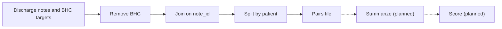
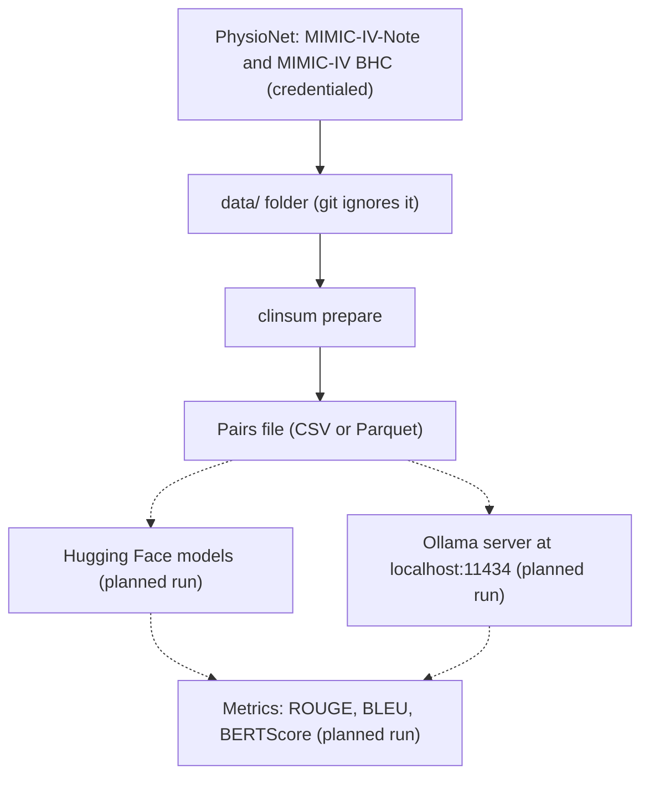
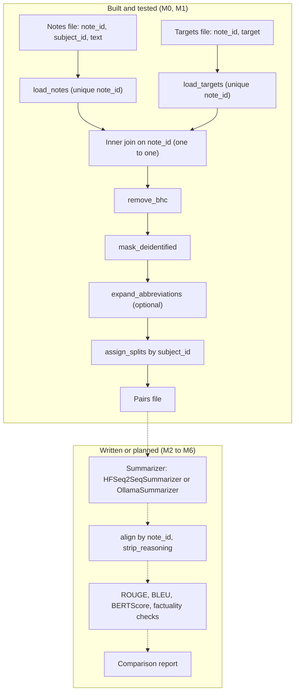

<div align="center">

# dischargebench — Brief Hospital Course Summarization Benchmark

**dischargebench is an early-stage benchmark for models that write the Brief Hospital Course (BHC) of a discharge note. Today it takes MIMIC-IV notes through these steps to leakage-free, `note_id`-aligned pairs. Model runs and scores are planned:**

`load notes` → `remove BHC` → `join on note_id` → `split by patient` → `summarize (planned)` → `score (planned)`.


**[Summary](#1-summary)** ·
**[Workflow](#4-the-end-to-end-workflow)** ·
**[Run it](#13-how-to-run-dischargebench)** ·
**[Configuration](#134-environment-variables)** ·
**[Known problems](#16-known-problems)** ·
**[Glossary](#18-glossary)**

</div>

> [!NOTE]
> This README uses ASD-STE100 Simplified Technical English. The writing rules and the project
> vocabulary are in [`docs/ste-style-guide.md`](docs/ste-style-guide.md). Each term in the
> [Glossary](#18-glossary) has only one meaning.

---

> [!IMPORTANT]
> dischargebench is in early development. Milestones M0 and M1 are complete: the project skeleton and the data tools, with tests.
> No model has run on the benchmark yet, and this README gives no model scores. Section [11](#11-the-controls-and-the-roadmap) shows what exists and what is planned.

> [!CAUTION]
> Do not use dischargebench or its outputs for patient care. It is a research benchmark, and no clinician checked a summary that it makes.
> Obey the PhysioNet Data Use Agreement for all MIMIC data.

dischargebench prepares a fair test for BHC summarization on de-identified MIMIC-IV notes.
A quick experiment often gives a high score for a wrong reason. For example, the input contains the reference summary, or the evaluation compares rows by position.
dischargebench makes each of these problems a design rule, and the code enforces the rules that exist today.
The Python package is `clinical_summarization`, and the command is `clinsum`.

This README is the **one location that explains all of dischargebench**. It gives these topics:

- the general design
- each component and its procedure, step by step
- the leakage controls and the roadmap
- the data map
- the runbook
- the validation results and the known problems

| If you are… | Read |
|---|---|
| A manager or reviewer | [1](#1-summary), [3](#3-design-rules), [11](#11-the-controls-and-the-roadmap), [15](#15-validation-results), [17](#17-key-points) |
| A developer who joins the project | All sections, in sequence. Keep [13](#13-how-to-run-dischargebench) and [16](#16-known-problems) open while you work |
| An operator who prepares data | [12](#12-data-and-file-map), [13](#13-how-to-run-dischargebench), then [8](#8-pair-preparation) |

---

## Table of contents

1. 🧭 [Summary](#1-summary)
2. 🏗️ [How dischargebench is built](#2-how-dischargebench-is-built)
   - 2.1 [Components](#21-components)
   - 2.2 [System context](#22-system-context)
   - 2.3 [Repository layout](#23-repository-layout)
3. 🛡️ [Design rules](#3-design-rules)
4. 🔄 [The end-to-end workflow](#4-the-end-to-end-workflow)
   - 4.1 [Full flow](#41-full-flow)
   - 4.2 [The life cycle of one note](#42-the-life-cycle-of-one-note)
5. 🔤 [Text tools](#5-text-tools)
6. 🔵 [Section parser and BHC removal](#6-section-parser-and-bhc-removal)
7. 🟢 [Patient-level splits](#7-patient-level-splits)
8. 🟣 [Pair preparation](#8-pair-preparation)
9. 🤖 [Model adapters](#9-model-adapters)
10. 📐 [Evaluation metrics](#10-evaluation-metrics)
11. ⚖️ [The controls and the roadmap](#11-the-controls-and-the-roadmap)
12. 🗂️ [Data and file map](#12-data-and-file-map)
13. ▶️ [How to run dischargebench](#13-how-to-run-dischargebench)
    - 13.1 [Prerequisites](#131-prerequisites) · 13.2 [Installation](#132-installation) · 13.3 [Run dischargebench](#133-run-dischargebench) · 13.4 [Environment variables](#134-environment-variables)
14. 🧩 [How to extend dischargebench](#14-how-to-extend-dischargebench)
15. ✅ [Validation results](#15-validation-results)
16. ⚠️ [Known problems](#16-known-problems)
17. 📌 [Key points](#17-key-points)
18. 📖 [Glossary](#18-glossary)
19. 📄 [License](#19-license)

---

## 1. Summary

**The problem.** A summarization benchmark on discharge notes can give a high score that is not true. These questions are difficult:

- How do you make sure that the model input does not contain the BHC, which is the reference summary?
- How do you make sure that each prediction is compared with the reference of the same note?
- How do you keep all notes of one patient in one split?
- How do you give each model the same test notes?
- How do you score a reasoning model that writes `<think>` text before the summary?

dischargebench gives each of these questions its own component. The data components exist and have tests. The model and score components are partly written or planned.

| Item | Value |
|---|---|
| Input | MIMIC-IV-Note discharge notes and MIMIC-IV BHC targets (PhysioNet, credentialed access) |
| Output today | A CSV or Parquet file of pairs: `note_id`, `subject_id`, `split`, `input_text`, `target`, `bhc_removed` |
| Output planned | Predictions for each model, scores and a comparison report (M2 to M6) |
| Components | **8** modules: text tools, section parser, splits, loaders, CLI, metrics, Hugging Face adapter, Ollama adapter |
| Models | None run yet. Two adapters exist without tests: Hugging Face seq2seq and Ollama |
| Offline mode | `clinsum prepare` and all tests run offline. Real data needs a PhysioNet Data Use Agreement |
| Safety | BHC removal, `note_id` join, patient-level splits, no data in git |
| Tests | **12** unit tests (`pytest`) |



---

## 2. How dischargebench is built

### 2.1 Components

| Component | Module | Purpose | State |
|---|---|---|---|
| Text tools | `src/clinical_summarization/text.py` | Remove `<think>` text, normalise white space, mask `___`, expand abbreviations | Built, tested |
| Section parser | `src/clinical_summarization/data/sections.py` | Find known sections. Remove or extract the BHC | Built, tested |
| Splits | `src/clinical_summarization/data/splits.py` | Deterministic patient-level train, val and test splits | Built, tested |
| Loaders | `src/clinical_summarization/data/loaders.py` | Read notes and targets. Build `note_id`-aligned pairs | Built, tested |
| CLI | `src/clinical_summarization/cli.py` | The `clinsum prepare` command | Built, run manually |
| Metrics | `src/clinical_summarization/eval/metrics.py` | `align` by `note_id`, then ROUGE, BLEU or BERTScore | `align` tested. `compute` not run |
| Seq2seq adapter | `src/clinical_summarization/models/seq2seq.py` | Hugging Face encoder-decoder with truncate or map-reduce | Written, not tested |
| LLM adapter | `src/clinical_summarization/models/llm.py` | Ollama with temperature 0, a seed and a versioned prompt | Written, not tested |
| Interface | `src/clinical_summarization/models/base.py` | The `Summarizer` protocol | Built |
| Prompt | `src/clinical_summarization/prompts/bhc_one_paragraph.txt` | The one-paragraph BHC prompt | Built |
| Config example | `configs/example.yaml` | The planned format of one experiment | No code reads it yet |

### 2.2 System context



### 2.3 Repository layout

```
dischargebench/
├── .github/workflows/ci.yml          # CI: Python 3.11, pip install -e ".[dev]", pytest -q
├── pyproject.toml                    # package clinical-summarization, extras hf, eval, llm, dev, script clinsum
├── configs/example.yaml              # planned experiment format (not read by code yet)
├── data/README.md                    # where to put the PhysioNet files (the folder is git-ignored)
├── src/clinical_summarization/
│   ├── text.py                       # reasoning tags, white space, de-identification blanks, abbreviations
│   ├── cli.py                        # clinsum prepare
│   ├── data/  loaders.py  sections.py  splits.py
│   ├── models/  base.py  seq2seq.py  llm.py
│   ├── eval/  metrics.py
│   └── prompts/bhc_one_paragraph.txt
└── tests/                            # 12 tests: sections, splits, alignment, text
```

---

## 3. Design rules

### 3.1 The model input never contains the reference
The BHC section of the full note is the reference summary. `remove_bhc` removes each BHC section from the input before any model sees it. `build_pairs` records `bhc_removed` for each note, and `clinsum prepare` prints the removal rate.

### 3.2 A problem line does not end the BHC
A BHC often contains lines such as `Atrial fibrillation: rate controlled`. The parser ends a section only at a known top-level header from a fixed list. Thus the rest of the BHC cannot leak into the input.

### 3.3 Pairs join on note_id, never on position
`build_pairs` joins notes and targets with an inner join on `note_id` and `validate="one_to_one"`. A duplicate `note_id` in either file raises `ValueError`.

### 3.4 Splits are patient-level and deterministic
`split_of` uses a SHA-256 hash of `seed:subject_id`. All notes of one patient go into the same split, on each machine, with nothing to store. An integer ID that pandas reads as a float (`10001.0`) gets the same split as `10001`.

### 3.5 Evaluation refuses unaligned inputs
`align` takes predictions and references as mappings from `note_id` to text. If a prediction has no reference, it raises `ValueError`. If a reference has no prediction, it also raises `ValueError`, unless you set `allow_subset=True`.

### 3.6 The scores exclude reasoning text
`strip_reasoning` removes each `<think>…</think>` block and an unclosed trailing `<think>` block. `align` and `OllamaSummarizer` call it before scoring.

### 3.7 Abbreviation expansion respects word boundaries
`expand_abbreviations` replaces a short form only when it stands alone. Thus `ART` in `ARTERIAL` and `DM` in `ADMIT` do not change. The expansion is off by default, so it can be an ablation.

### 3.8 No data goes into the repository
The MIMIC data needs a PhysioNet Data Use Agreement. Git ignores `data/*` (except `data/README.md`), `*.csv`, `*.parquet` and `runs/`. Do not commit notes, summaries or outputs that contain note text.

---

## 4. The end-to-end workflow

### 4.1 Full flow



### 4.2 The life cycle of one note

1. Put the PhysioNet files in `data/`.
2. `clinsum prepare` reads the note and its target by `note_id`.
3. The loader joins the note and the target. A note without a target is dropped.
4. `remove_bhc` removes the BHC section from the note text.
5. `mask_deidentified` changes each `___` blank into `[REDACTED]`.
6. If `--expand-abbreviations` is set, the known short forms are expanded.
7. `split_of` gives the note the split of its patient.
8. If the input is empty after these steps, the note is dropped.
9. The command writes the pair to the output file.
10. Planned: a summarizer writes a prediction, and the metrics compare it with the target by `note_id`.

---

## 5. Text tools

**Purpose.** Give small, deterministic text functions to the data and evaluation components.

| Function | Input | Output |
|---|---|---|
| `normalize_whitespace` | A text or `None` | The text with each run of white space changed into one space |
| `strip_reasoning` | A model output | The output without `<think>` blocks, with normalised white space |
| `mask_deidentified` | A note text | The text with each `___` (3 or more underscores) changed into `[REDACTED]` |
| `expand_abbreviations` | A note text and an optional mapping | The text with standalone short forms expanded |

**Rules**

- `DEFAULT_ABBREVIATIONS` has 13 entries, for example `HTN`, `DM`, `CHF`, `COPD`, `s/p` and `h/o`.
- The list leaves out ambiguous short forms, for example `SZ`, `BPD` and `d/c`.
- Matching is case-sensitive, and the longest key is tried first.
- A short form next to a letter, a digit or `/` is not expanded.

---

## 6. Section parser and BHC removal

**Purpose.** Find the known sections of a discharge note and remove the reference summary from the input.

| Input | Output |
|---|---|
| A note text | `find_sections`: a list of `Section(name, start, end)`. `remove_bhc`: the text without the BHC and a flag. `extract_bhc`: the BHC body or `None` |

**Procedure**

1. Find each line that starts with a known header and a colon, for example `Chief Complaint:`. Case does not matter.
2. A section ends where the next known header starts, or at the end of the text.
3. `remove_bhc` removes each section named `Brief Hospital Course` or `Hospital Course`.
4. `remove_bhc` returns the text and `True` if it removed a section.
5. `extract_bhc` returns the body of the first BHC section, without the header.

**Rules**

- The known headers are 20: 18 standard headers (for example `History of Present Illness`, `Discharge Medications`, `Allergies`) and the 2 BHC headers.
- The parser does not use a generic `Word:` pattern, because a problem line in the BHC can end the section early.
- A note without a BHC header is not changed, and the flag is `False`.

---

## 7. Patient-level splits

**Purpose.** Give each patient one split, the same on each machine and in each run.

| Input | Output |
|---|---|
| A `subject_id`, a seed (default 42) and ratios (default 0.8, 0.1, 0.1) | `train`, `val` or `test` |

**Procedure**

1. If the ID is a float with an integer value, change it to an integer.
2. Calculate the SHA-256 hash of `"<seed>:<subject_id>"`.
3. Change the first 8 bytes into a number `u` from 0 to 1.
4. If `u < 0.8`, the split is `train`. If `u < 0.9`, the split is `val`. Otherwise the split is `test`.

**Rules**

- The ratios must add up to 1. Otherwise `split_of` raises `ValueError`.
- `assign_splits` needs the column `subject_id` (or the column that you give). Otherwise it raises `KeyError`.
- A different seed gives different splits. All models in one comparison must use the same seed.

---

## 8. Pair preparation

**Purpose.** Make the `note_id`-aligned (input, target) pairs that all models will use.

| Input | Output |
|---|---|
| A notes file (`note_id`, `subject_id`, `text`) and a targets file (`note_id`, `target`), CSV or Parquet | A CSV or Parquet file with `note_id`, `subject_id`, `split`, `input_text`, `target`, `bhc_removed` |

**Procedure**

1. `load_notes` and `load_targets` read only the necessary columns. An absent column raises `KeyError`.
2. A duplicate `note_id` in either file raises `ValueError`.
3. `build_pairs` joins on `note_id`, prepares each input (sections 4.2 and 6) and assigns the splits.
4. `clinsum prepare` keeps only the requested split (`--split`, default `all`).
5. If `--limit N` is more than 0, the command sorts by `note_id` and keeps the first N pairs.
6. The command writes the file and prints the number of pairs and the BHC removal rate.

| Option | Default | Meaning |
|---|---|---|
| `--notes` | (required) | Path of the notes file |
| `--targets` | (required) | Path of the targets file |
| `--out` | (required) | Output path. `.parquet` writes Parquet, other suffixes write CSV |
| `--split` | `all` | `all`, `train`, `val` or `test` |
| `--limit` | `0` (no limit) | Keep the first N pairs by `note_id` |
| `--seed` | `42` | Seed of the patient-level split |
| `--expand-abbreviations` | off | Expand the known short forms |
| `--keep-reference` | off | Do not remove the BHC. Use it only for a leakage ablation |

**Rules**

- The same `--split`, `--limit` and `--seed` give the same notes for each model.
- The `.parquet` output needs `pyarrow` or `fastparquet`. The package does not install them.

---

## 9. Model adapters

**Purpose.** Give each model one interface: `summarize(texts) -> summaries`, in the same order.

| Adapter | Extra | Settings | State |
|---|---|---|---|
| `HFSeq2SeqSummarizer` | `hf` | `model_name`, `max_input_tokens=1024`, `max_new_tokens=256`, `num_beams=4`, `long_input="chunk"`, `chunk_overlap=64`, `prefix`, `device` | Written, not run in tests |
| `OllamaSummarizer` | `llm` | `model`, `prompt="bhc_one_paragraph"`, `temperature=0.0`, `seed=42`, `host="http://localhost:11434"`, `timeout=600` | Written, not run in tests |

**Procedure (`HFSeq2SeqSummarizer`)**

1. Count the tokens of the input.
2. If the input fits in `max_input_tokens − 32`, generate the summary with beam search.
3. If the input is longer, add 1 to `truncated`.
4. With `long_input="truncate"`, generate from the truncated input.
5. With `long_input="chunk"`, split the tokens into overlapping chunks and summarize each chunk (map).
6. Join the chunk summaries and summarize them again (reduce).

**Procedure (`OllamaSummarizer`)**

1. Load the prompt template from `prompts/<name>.txt`.
2. Send `POST <host>/api/generate` with `stream=false`, the temperature and the seed.
3. Remove `<think>` text from the response.

**Rules**

- The prompt tells the model to write one paragraph and to use only facts from the note.
- No command calls these adapters yet. Milestones M2 and M3 will run them.

---

## 10. Evaluation metrics

**Purpose.** Compare predictions with references of the same note.

| Input | Output |
|---|---|
| `predictions` and `references` as mappings from `note_id` to text, and a list of metrics | A dict with `n` and one entry for each metric |

**Procedure**

1. `align` checks the `note_id` sets (section 3.5).
2. `align` sorts the IDs and removes `<think>` text from each prediction.
3. `compute` loads each metric with the Hugging Face `evaluate` package (extra `eval`).
4. `rouge` uses stemming. `bleu` uses one reference for each prediction. `bertscore` gives the mean precision, recall and F1 (English).

**Rules**

- An unknown metric name raises `ValueError`.
- `compute` downloads the metric code (and the BERTScore model) the first time. Thus it is not offline.
- The planned factuality checks (medications, doses, diagnoses) and the human-review rubric do not exist yet.

---

## 11. The controls and the roadmap

| Problem | Control | State |
|---|---|---|
| The input contains the reference summary | `remove_bhc` and the `bhc_removed` rate | Built, tested |
| A problem line ends the BHC early | Fixed list of known headers | Built, tested |
| Comparison by row position | `build_pairs` join and `align` | Built, tested |
| One patient in two splits | Hash of `subject_id` | Built, tested |
| Different models on different notes | One seeded split and `--limit` sorted by `note_id` | Built |
| Reasoning text is scored | `strip_reasoning` | Built, tested |
| Abbreviation expansion corrupts words | Word-boundary expansion, off by default | Built, tested |
| Long notes are truncated in silence | `truncated` counter and map-reduce chunks | Written, not tested, counter not reported |
| LLM runs are not reproducible | Temperature 0, seed, versioned prompt | Written. Saving the config with each run is planned |
| ROUGE does not see dangerous errors | Factuality checks and a human-review rubric | Planned (M5) |

| Milestone | Content | State |
|---|---|---|
| M0 | Project skeleton, MIT license, CI | Done |
| M1 | BHC removal, `note_id` alignment, patient-level splits, tests | Done |
| M2 | Zero-shot baselines (BART, PEGASUS, T5, LongT5) on one shared test split | Planned |
| M3 | LLM runs (LLaMA 3.x, DeepSeek-R1, Mistral) with deterministic decoding and prompt versions | Planned (adapter written) |
| M4 | LoRA fine-tune (Flan-T5 or BART) on the BHC train split | Planned |
| M5 | Clinical factuality evaluation and a human-review rubric | Planned |
| M6 | Experiment tracking and a generated comparison report | Planned |

---

## 12. Data and file map

| Path | Committed? | Contents |
|---|---|---|
| `data/README.md` | Yes | Where to get and put the PhysioNet files |
| `data/discharge.csv` | No (git ignores it) | MIMIC-IV-Note discharge notes: `note_id`, `subject_id`, `text` |
| `data/mimic-iv-bhc.csv` | No (git ignores it) | MIMIC-IV BHC labelled notes: `note_id`, `target` |
| `data/test_pairs.csv` (example) | No (git ignores it) | Output of `clinsum prepare` |
| `runs/` | No (git ignores it) | Planned place for predictions and scores |
| `configs/example.yaml` | Yes | Planned experiment format: data, model, generation, metrics |
| `src/clinical_summarization/prompts/bhc_one_paragraph.txt` | Yes | The BHC prompt template |

---

## 13. How to run dischargebench

### 13.1 Prerequisites

| Need | For |
|---|---|
| Python 3.10+ | All components (CI uses 3.11) |
| `pandas>=2.0`, `pyyaml>=6.0` | Core (installed with the package) |
| PhysioNet credentialed access | The MIMIC-IV-Note and MIMIC-IV BHC files |
| Extra `hf` (`torch`, `transformers>=4.40`, `sentencepiece`) | `HFSeq2SeqSummarizer` |
| Extra `llm` (`requests>=2.31`) and an Ollama server | `OllamaSummarizer` |
| Extra `eval` (`evaluate`, `rouge-score`, `bert-score`, `nltk`) | `metrics.compute` |
| `pyarrow` | A `.parquet` input or output |

### 13.2 Installation

```bash
git clone https://github.com/KrishnaAnnavaram/dischargebench.git
cd dischargebench
python -m venv .venv
. .venv/bin/activate            # Windows: .venv\Scripts\activate
pip install -e ".[dev]"
```

### 13.3 Run dischargebench

```bash
pytest -q                       # 12 tests, no data necessary
clinsum --version
clinsum prepare --notes data/discharge.csv --targets data/mimic-iv-bhc.csv \
                --split test --limit 1000 --out data/test_pairs.csv
clinsum prepare --notes data/discharge.csv --targets data/mimic-iv-bhc.csv \
                --keep-reference --out data/leak_ablation.csv     # leakage ablation only
```

Example output (from a synthetic file of 6 notes, 5 with a BHC):

```
wrote 6 pairs to out/pairs.csv  (BHC section removed from 83.3% of inputs)
```

If the removal rate is low on real notes, examine the headers before you use the pairs.

### 13.4 Environment variables

dischargebench reads no environment variables today. The Ollama host and the model names are constructor arguments. There is no `.env.example` file.
Do not put PhysioNet credentials, notes or summaries in the repository.

---

## 14. How to extend dischargebench

| You want to… | Do this | Code change? |
|---|---|---|
| Add a section header | Add the name to `KNOWN_HEADERS` in `sections.py` and add a test | Small |
| Add an abbreviation | Pass a mapping to `expand_abbreviations`, or add it to `DEFAULT_ABBREVIATIONS` | No / Small |
| Add a prompt version | Add `prompts/<name>.txt` with a `{note}` field. Pass `prompt="<name>"` | No |
| Add a model | Make a class with `name` and `summarize(texts)` (the `Summarizer` protocol) | Small |
| Add a metric | Add a branch in `metrics.compute` | Small |
| Run an experiment from a config | Add a `clinsum run` command that reads `configs/*.yaml` (milestone M2) | Yes |

---

## 15. Validation results

| Validation | Result | Command |
|---|---|---|
| Unit tests | **12 passed** | `pytest -q` |
| `clinsum prepare` on 6 synthetic notes | 6 pairs, BHC removed from 5 of 5 notes with a BHC, `___` masked, both notes of patient 1 in one split | `clinsum prepare ...` |
| Model scores | None. No model has run yet | Planned (M2) |
| CI | Python 3.11, `pytest -q` on each push | `.github/workflows/ci.yml` |

The tests prove the BHC removal, also with problem lines in the BHC. They prove the `note_id` join when the targets are in reversed order.
They also prove the split ratios (within 2 % on 20,000 IDs), the `align` checks and the text tools.
They do not prove that the header list covers all real MIMIC-IV notes. Check the `bhc_removed` rate on real data.

---

## 16. Known problems

Read these problems before you use dischargebench for a result.

| # | Area | Problem | Impact and action |
|---|---|---|---|
| 1 | Scope | No model has run, and there are no scores | Do not cite results from this repository yet. M2 plans the first baselines |
| 2 | CLI | Only `prepare` exists. No command runs a model or a metric. No code reads `configs/example.yaml` | Call the adapters and `metrics.compute` from Python until M2 |
| 3 | Adapters | `HFSeq2SeqSummarizer` and `OllamaSummarizer` have no tests | Test them on a small sample before a full run |
| 4 | Long inputs | `truncated` counts each long input in both modes, and no code reports it. The reduce step truncates long joined summaries without a count | Report the counter yourself. A fix is planned with M2 |
| 5 | BHC removal | A BHC header without a colon, or with a name outside the list, is not found | The reference can leak. Check that `bhc_removed` is near 100 % |
| 6 | BHC removal | An unknown header after the BHC is removed with the BHC | The input loses that section. Add the header to `KNOWN_HEADERS` |
| 7 | Data | A note whose input is empty after preparation is dropped, with no count | Compare the number of pairs with the number of notes |
| 8 | Data | `mask_deidentified` always runs. It is not an option | Masked text is the only input form |
| 9 | Metrics | `compute` downloads metric code and models the first time | Run it once with network, or cache the metrics |
| 10 | Output | A `.parquet` file needs `pyarrow`, which the package does not install | Install `pyarrow`, or write CSV |

---

## 17. Key points

1. **The model input never contains the reference.** `remove_bhc` removes the BHC before any model sees the note, and the command prints the removal rate.
2. **A problem line does not end the BHC.** Only a known top-level header ends a section.
3. **Pairs and scores use `note_id`, not position.** The join is one-to-one, and `align` refuses unmatched IDs.
4. **Each patient has one split.** The split comes from a hash of the seed and `subject_id`, on each machine.
5. **The project is early.** The data tools exist and have tests. Model runs, factuality checks and reports are planned.
6. **No data goes into git.** The PhysioNet Data Use Agreement forbids it, and `.gitignore` enforces the folder rules.

---

## 18. Glossary

| Term | Meaning |
|---|---|
| **Ablation** | A run that changes one setting, for example `--keep-reference`, to measure its effect |
| **BHC** | Brief Hospital Course: the section of a discharge note that the model must write |
| **Chunk** | A part of a long input, with an overlap of tokens, for the map-reduce mode |
| **Discharge note** | The full MIMIC-IV-Note text of one hospital stay |
| **Input text** | The discharge note after BHC removal, masking and the optional expansion |
| **Known header** | One of the 20 section names that can start or end a section |
| **Leakage** | Information from the reference, or from another split, in the model input |
| **Map-reduce** | Summarize each chunk, then summarize the joined chunk summaries |
| **note_id** | The unique ID of one discharge note. All joins use it |
| **Pair** | One row of the pairs file: the input text and the target of one note |
| **Prediction** | The summary that a model writes for one note |
| **Reference** | The target BHC text of one note |
| **Split** | `train`, `val` or `test`, given to each patient |
| **subject_id** | The ID of one patient in MIMIC-IV |
| **Summarizer** | A model adapter with `summarize(texts) -> summaries` |
| **Target** | The reference BHC in the targets file |

---

## 19. License

[MIT](LICENSE) © 2026 Krishna Annavaram
